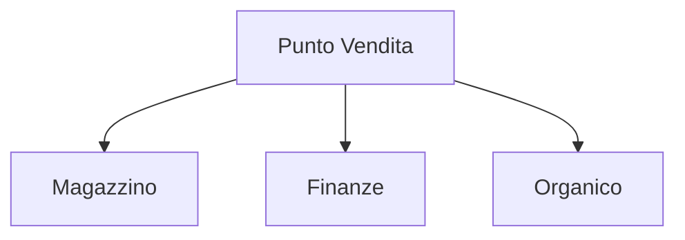

# Schema input e Output metodi - Software Gestionale "Mondadoro"
### Gestionale di un punto vendita - Modalità ASP.NET Web Forms

## Magazzino:
### Gestione dei prodotti presenti nel magazzino salvati all'interno della lista `listOfProduct()`:

### Classe `Product`:

#### Metodi:
- `searchProduct(productId)` -> productQuantity
- `addProduct(productId, quantityAdd)` ->  productQuantity
- `removeProduct(productId, quantityRemove)` ->  productQuantity
- `createProduct(name, listPrice, sellingPrice, productQuantity)` -> void
- `deleteProduct(productId)` -> void
##
## Organico:
### Gestione del personale presente nel negozio salvato all'interno della lista `listOfPeople()`:

### Classe `Person`:
#### Attributi:
- `string name` -> Nome della persona;
- `string role` -> Ruolo coperto;
- `double wage` -> Salario.

#### Metodi:
- `createPerson()` -> Questo metodo permette di creare una persona;
- `deletePerson()` -> Questo metodo permette di cancellare una persona.
##
## Finanze:
### Visualizzazione del saldo ed auto-aggiornamento in base ai salari e alle vendite dei prodotti.
#### Attributi:
- `double currentBalance` -> Soldi presenti nel conto corrente dell'azienda;
#### Metodi:
- `updateBalance()` -> Questo metodo aggiorna automaticamente il saldo;
- `showBalance()` -> Questo metodo permette di visualizzare il saldo.
---
###### Matteo Orifiammi (PM); Angelo Pavan; Simone Giuriato; Federico Rossi - 4F - 30/11/2021
