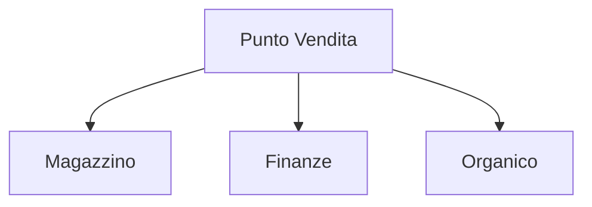

# Schema input e Output metodi - Software Gestionale "Mondadoro"
### Gestionale di un punto vendita - Modalità ASP.NET Web Forms

## Magazzino:
### Gestione dei prodotti presenti nel magazzino salvati all'interno della lista `listOfProduct()`:

### Classe `Product`:
#### Attributi:
- `int id` -> Id del prodotto;
- `string name`  -> Nome del prodotto;
- `double listPrice` -> Prezzo di acquisto/listino;
- `double sellingPrice` -> Prezzo di vendita;
- `int qnty` -> Quantita' del prodotto.

### Sottoclasse `bookProduct : Product`:
#### Attributi:
- `int isbnCode` -> Codice isbn del libro;
- `string genre` -> Genere del libro.

### Sottoclasse `otherProduct : Product`:
#### Attributo:
- `int eanCode` -> Codice ean del prodotto;
- `string category` -> Categoria del prodotto;

#### Saranno inoltre presenti i seguenti metodi:
- `searchProduct` -> Questo metodo permette di cercare un prodotto all'interno della lista di prodotti;
- `addProduct` -> Questo metodo permette di aggiungere una quantita' ad un prodotto;
- `removeProduct` -> Questo metodo permette di rimuovere una quantita' ad un prodotto;
- `createProduct` -> Questo metodo permette di creare un nuovo prodotto;
- `deleteProduct` -> Questo metodo permette di cancellare un prodotto.
##
## Organico:
### Gestione del personale presente nel negozio salvato all'interno della lista `listOfPeople()`:

### Classe `Person`:
#### Attributi:
- `string name` -> Nome della persona;
- `string role` -> Ruolo coperto;
- `double wage` -> Salario.

#### Metodi:
- `createPerson()` -> Questo metodo permette di creare una persona;
- `deletePerson()` -> Questo metodo permette di cancellare una persona.
##
## Finanze:
### Visualizzazione del saldo ed auto-aggiornamento in base ai salari e alle vendite dei prodotti.
#### Attributi:
- `double currentBalance` -> Soldi presenti nel conto corrente dell'azienda;
#### Metodi:
- `updateBalance()` -> Questo metodo aggiorna automaticamente il saldo;
- `showBalance()` -> Questo metodo permette di visualizzare il saldo.
---
###### Matteo Orifiammi (PM); Angelo Pavan; Simone Giuriato; Federico Rossi - 4F - 30/11/2021
